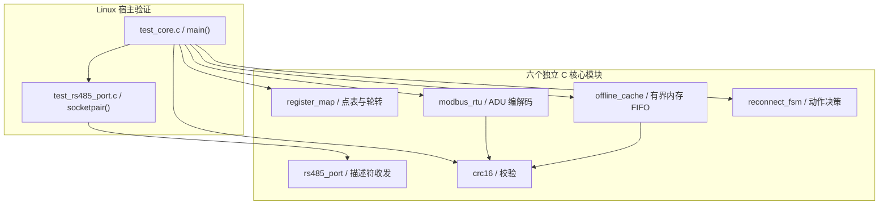

# 嵌入式 Linux 工业采集与边缘网关核心

[](https://github.com/xiaoli5201314-spec/embedded-linux-qt-edge-gateway/actions/workflows/ci.yml)

**C99 / Modbus RTU / RS485 / 寄存器解码 / 内存缓存 / 重连状态机**

面向工业仪表采集与边缘数据缓冲，将协议、传输、点表和恢复策略组织为六个独立的 C 模块。项目的重点是把“设备返回什么字节、如何转换成工程值、积压数据如何有序处理”表达为清晰的接口，并通过 Linux 宿主测试复现关键行为。

**本仓库展示项目的公开代码与技术文档。**

阅读重点：**协议与传输解耦、异构寄存器建模、有界资源管理、动作驱动状态机、可注入的端口测试。**

快速入口：[验证记录](docs/VERIFICATION.md) · [构建与测试](docs/BUILD_AND_TEST.md) · [架构与 API](docs/ARCHITECTURE.md) · [核心测试](core/test/test_core.c) · [端口测试](core/test/test_rs485_port.c)

**宿主验证记录：170 checks、0 failed、PASS。** 2026-10-02，在 WSL Ubuntu-22.04 / GCC 11.4.0 执行 `make -C core -B test`；准确命令、复测条目及测试范围见 [VERIFICATION.md](docs/VERIFICATION.md)。

## 项目与业务场景

工业采集的常见难点是设备数据表达不一致、串口传输与协议处理相互耦合，以及链路恢复时历史数据和新数据的处理顺序。这里按职责拆分这些问题，让每个模块都有可阅读的输入、输出和测试入口。

| 场景 | 需要处理的问题 | 对应公开组件 |
|---|---|---|
| 工业仪表寄存器采集 | 从站地址、寄存器范围、功能码、CRC 与异常响应 | Modbus RTU 编解码、CRC16 |
| 多型号设备的数据统一 | 有符号数、32 位字序、浮点字序、比例和偏移 | 寄存器点表与解码 |
| 不同刷新频率的数据采集 | 快速点与低频点共存、轮转公平性、隔离标记 | 1 / 5 / 30 秒选点调度 |
| 链路波动期间的数据缓冲 | 有限容量、历史顺序、处理确认与丢弃计数 | 进程内存 FIFO 缓存 |
| 链路恢复时的处理策略 | 重试间隔、积压优先、恢复后发送新数据 | 重连动作状态机 |

这些组件适合从嵌入式通信、Linux 串口编程和边缘数据处理三个角度阅读，也便于结合实际设备的寄存器表进行接口调用。

## 技术亮点

| 技术点 | 源码中的具体设计 | 阅读入口 |
|---|---|---|
| 协议与传输分离 | 编解码接口操作字节缓冲区，串口端口独立管理描述符和 DE | [modbus_rtu.c](core/src/modbus_rtu.c)、[rs485_port.c](core/src/rs485_port.c) |
| 多种 CRC 接口 | 按位、查表和增量计算，复用于协议帧与缓存槽位校验 | [crc16.c](core/src/crc16.c)、[crc16.h](core/include/crc16.h) |
| 声明式采集点 | 从站、寄存器范围、字序、缩放、单位和周期放在点表中 | [register_map.h](core/include/register_map.h) |
| 轮转与到期判断 | 每点维护时间戳，轮转游标推进，统计生成与跳过次数 | [register_map.c](core/src/register_map.c) |
| 明确的缓存消费语义 | `put` 追加、`peek` 查看、`commit` 移除，满容量时丢旧并计数 | [offline_cache.c](core/src/offline_cache.c) |
| 策略返回动作 | 状态机根据链路、积压和新数据返回下一动作，连接失败采用有上限的指数退避 | [reconnect_fsm.c](core/src/reconnect_fsm.c) |
| 传输测试可注入 | `rs485_open_fd()` 接入测试描述符，弱符号 DE 钩子可覆写观察 | [test_rs485_port.c](core/test/test_rs485_port.c) |
| 轻量测试入口 | C 断言汇总检查数、失败数和退出码，GNU Make 与 CI 使用同一入口 | [test_core.c](core/test/test_core.c)、[core/Makefile](core/Makefile) |

## 系统架构

核心采用模块化组织。下图展示公开源码的依赖和测试关系：测试分别驱动各模块，Modbus 编解码与缓存校验复用 CRC。



接口、数据结构与状态转换的详细说明见 [ARCHITECTURE.md](docs/ARCHITECTURE.md)。

## 核心机制

### 1. Modbus RTU 与字节序

[modbus_rtu.h](core/include/modbus_rtu.h) 定义请求、响应和异常码，调用入口为 `modbus_build_request()` 与 `modbus_parse_response()`。

| 功能码 | 操作 | 接口处理 |
|---|---|---|
| `0x03` | 读取保持寄存器 | 构造地址与数量字段，解析返回的寄存器数组 |
| `0x06` | 写单个寄存器 | 构造单寄存器请求，解析响应字段 |
| `0x10` | 写多个寄存器 | 序列化寄存器数组，解析写入范围响应 |

协议字段使用明确的字节序：

- 寄存器地址、数量和寄存器值：高字节在前。
- 帧末 CRC16：低字节在前。
- 请求 ADU 缓冲区：按 `MODBUS_MAX_ADU` 分配 256 字节。
- 单次读取上限：125 个寄存器；单次多寄存器写入上限：123 个。
- 响应解析：输入完整 ADU，检查 CRC、从站、功能码和长度。
- 异常展示：`modbus_exception_str()` 将结果转换为可读名称。

协议模块的输入输出都是内存缓冲区，便于直接构造正常帧、异常帧和损坏帧进行验证。

### 2. 寄存器点表与工程值

`reg_point_t` 将设备描述与解码方式放在同一条配置中：

| 字段组 | 内容 |
|---|---|
| 请求位置 | `slave`、`function`、`start_addr`、`quantity` |
| 解码位置 | `word_offset`、`type` |
| 工程值表达 | `scale`、`offset`、`unit` |
| 采集组织 | `name`、`device_id`、`poll_class` |

`reg_map_decode()` 按类型读取一个或两个寄存器，再执行 `raw * scale + offset`。

| 类型 | 字序与数值解释 |
|---|---|
| `REG_U16` | 16 位无符号整数 |
| `REG_S16` | 16 位有符号整数 |
| `REG_U32_BE` | 32 位整数，高字在前 |
| `REG_U32_WORD_SWAP` | 32 位整数，低字在前 |
| `REG_FLOAT_ABCD` | IEEE754 单精度，高字在前 |
| `REG_FLOAT_CDAB` | IEEE754 单精度，交换两个寄存器字 |

点表容量为 64 条。`reg_map_add()` 添加描述，`poll_scheduler_reset()` 初始化调度记录，`poll_scheduler_next()` 返回一个到期寄存器范围。

三个刷新等级分别为 1000、5000、30000 毫秒。调度器检查到期时间和隔离标记后推进轮转游标，并累计生成、未到期跳过、隔离跳过等统计。

结合本仓库编解码器使用的采集请求选择 `0x03`；隔离数组按从站地址索引，调度器检查的地址范围为小于 32。

### 3. Linux RS485 端口

[rs485_port.c](core/src/rs485_port.c) 把打开、发送、发送完成和接收分为独立操作：

1. `rs485_open()` 打开并配置串口；`rs485_open_fd()` 接入调用方持有的描述符。
2. `rs485_write()` 通过 `rs485_de_set()` 拉起发送方向并写入字节。
3. `rs485_tx_complete()` 等待发送完成，结合保护时间释放 DE。
4. `rs485_read()` 读取可用字节；`rs485_reset_queues()` 清理端口队列。

Linux 路径使用 `termios`、`poll`、`TIOCOUTQ` 与 `tcdrain()`。DE 通过可覆写的弱符号接口表达，测试用自定义钩子记录切换顺序。

`rs485_open_fd()` 借用描述符，描述符生命周期由调用方负责；接收接口返回字节片段，调用方按协议帧组织这些数据。

### 4. 有界内存缓存

`offline_cache_t` 是进程内存中的 FIFO，容量为 **512 个槽位**，每条载荷最多 **48 字节**。

槽位包含序号、秒级时间戳、设备 ID、载荷长度、载荷、CRC 和有效标记。

| API | 行为 |
|---|---|
| `offline_cache_init()` | 初始化队列和序号 |
| `offline_cache_put()` | 追加记录；满容量时丢弃最旧记录并增加 `dropped` |
| `offline_cache_peek()` | 拷贝最旧记录，保留队列内容 |
| `offline_cache_commit()` | 移除最旧记录 |
| `offline_cache_verify()` | 扫描有效槽位并统计 CRC 损坏 |

“查看”与“提交”分离，让调用方可以在处理确认后消费队首。容量和丢弃计数同时公开，便于观察缓冲压力。

### 5. 重连动作状态机

`reconnect_fsm_t` 维护四个状态：`IDLE`、`CONNECTING`、`DRAINING`、`ONLINE`。

调用方向 `reconnect_fsm_tick()` 输入经过的时间、链路状态、积压数量和新数据数量，获得下一步动作：

| 动作 | 调用方处理 |
|---|---|
| `FSM_ACT_WAIT` | 等待链路条件或退避时间 |
| `FSM_ACT_TRY_CONNECT` | 执行连接尝试并报告结果 |
| `FSM_ACT_DRAIN_ONE` | 优先处理一条积压记录 |
| `FSM_ACT_SEND_FRESH` | 处理新的数据 |
| `FSM_ACT_NONE` | 本次无需数据动作 |

失败结果使退避时间倍增至上限，成功结果重置退避。连接成功后，调用方将状态设置为 `UPLINK_DRAINING`；积压清空后，状态机切换到 `UPLINK_ONLINE`。

链路和记录处理由调用方执行，状态机专注动作决策。`drained_records` 记录补传动作次数，处理确认由调用方管理。

## 源码与文档导览

| 路径 | 阅读内容 |
|---|---|
| [core/Makefile](core/Makefile) | 宿主测试、静态库交叉编译与清理目标 |
| [core/include/](core/include/) | 六个模块的公开结构体、枚举和函数签名 |
| [core/src/](core/src/) | 各模块的 C99 实现 |
| [core/include/modbus_rtu.h](core/include/modbus_rtu.h) | 请求、响应、容量与异常码 |
| [core/src/modbus_rtu.c](core/src/modbus_rtu.c) | `03/06/10` 功能码的字节编解码 |
| [core/src/crc16.c](core/src/crc16.c) | 按位、查表与增量 CRC |
| [core/src/register_map.c](core/src/register_map.c) | 六种寄存器解码与轮转选点 |
| [core/src/rs485_port.c](core/src/rs485_port.c) | 串口配置、描述符收发与 DE 钩子 |
| [core/src/offline_cache.c](core/src/offline_cache.c) | 内存 FIFO、槽位校验和消费操作 |
| [core/src/reconnect_fsm.c](core/src/reconnect_fsm.c) | 状态推进、退避与动作返回 |
| [core/test/test_core.c](core/test/test_core.c) | 核心测试及聚合入口 |
| [core/test/test_rs485_port.c](core/test/test_rs485_port.c) | socketpair 收发和 DE 顺序测试 |
| [docs/ARCHITECTURE.md](docs/ARCHITECTURE.md) | 模块职责、数据契约与 API 说明 |
| [docs/BUILD_AND_TEST.md](docs/BUILD_AND_TEST.md) | 构建前提、命令和日志解读 |
| [docs/VERIFICATION.md](docs/VERIFICATION.md) | 日期、工具链、运行结果与测试范围 |
| [.github/workflows/ci.yml](.github/workflows/ci.yml) | Ubuntu GCC 自动测试入口 |
| [.gitignore](.gitignore) | 构建产物、日志与敏感文件排除规则 |

## 代码阅读路线

**快速了解项目：** 先看技术亮点和架构图，再查看 [验证记录](docs/VERIFICATION.md)，把项目能力与可执行证据对应起来。

**按源码深入：**

1. [test_core.c](core/test/test_core.c)：从 `main()` 和协议测试开始，了解正常输入、异常输入和结果汇总。
2. [modbus_rtu.h](core/include/modbus_rtu.h) → [modbus_rtu.c](core/src/modbus_rtu.c)：跟踪请求结构体如何变成 ADU，以及响应如何返回寄存器数组。
3. [register_map.h](core/include/register_map.h) → [register_map.c](core/src/register_map.c)：检查字序、比例、偏移和调度统计。
4. [offline_cache.c](core/src/offline_cache.c)：沿 `put` → `peek` → `commit` 观察序号、队首和满容量行为。
5. [reconnect_fsm.c](core/src/reconnect_fsm.c)：对照测试输入，检查退避、积压优先与状态切换。
6. [rs485_port.c](core/src/rs485_port.c) → [端口测试](core/test/test_rs485_port.c)：理解描述符借用、发送完成与 DE 钩子的可测试性。

## 快速开始

### 环境与位置

使用 Linux shell，在仓库根目录执行。环境需要 GCC、GNU Make 和 Linux/POSIX 开发头文件；Windows 可使用 WSL Ubuntu。

### 强制重建并运行宿主测试

```bash
make -C core -B test CC=gcc
```

该命令通过 [core/Makefile](core/Makefile) 编译六个源模块和两个测试文件，然后执行 `core/build/test_core`。

常规清理和测试入口：

```bash
make -C core clean
make -C core test CC=gcc
```

默认目标 `all: test`，因此以下命令同样会构建并运行测试：

```bash
make -C core CC=gcc
```

| 构建项 | 默认设置 |
|---|---|
| C 标准与优化 | `-std=c99 -O2` |
| 编译检查 | `-Wall -Wextra -Wpedantic -Wshadow -Wconversion` |
| 链接库 | `-lm` |
| 宿主产物 | `core/build/test_core` |
| 结果判据 | `failed` 为 0，程序退出码为 0 |

### 静态库交叉编译入口

安装对应 ARM Linux 工具链后，可调用现有 `cross` 目标：

```bash
make -C core cross CROSS_CC=arm-linux-gnueabihf-gcc
```

目标产物为 `core/build/libgateway_core.a`。规则调用交叉编译器和宿主 `ar`，使用前确认归档工具兼容性；此入口与宿主测试是两个独立目标。具体规则见 [BUILD_AND_TEST.md](docs/BUILD_AND_TEST.md)。

## 验证与自动测试

| 项目 | 已记录结果 |
|---|---|
| 验证日期 | 2026-10-02 |
| 宿主 | WSL Ubuntu-22.04 |
| 编译器 | GCC 11.4.0 |
| 原始命令 | `make -C core -B test` |
| 检查数 | **170 checks** |
| 失败数 | **0 failed** |
| 结果 | **PASS** |

原始记录与显式选择 GCC 的推荐命令分别列示，便于复现和核对。

测试覆盖 CRC、请求与响应编解码、寄存器解码、轮转选点、缓存消费、状态机动作，以及 socketpair 描述符和 DE 钩子。170 是断言检查数；测试范围和复测条目见 [VERIFICATION.md](docs/VERIFICATION.md)。

[CI 工作流](.github/workflows/ci.yml) 在 Ubuntu 上清理并执行 GCC 宿主测试，支持 push、pull request 和手动触发。最新工作流状态通过首页徽章查看。

## API 使用约定

- **帧与缓冲区：** 请求按 256 字节契约分配；响应解析接收完整 ADU；串口读出的片段由调用方组帧。
- **对象与同步：** 点表、缓存和状态机对象由调用方持有；共享对象访问及 CRC 查表首次初始化采用调用方同步。
- **端口调用：** `rs485_write()` 可能反复等待可写，TTY 发送完成路径使用可能阻塞的 `tcdrain()`，按此安排调用线程。
- **数值检查：** `reg_map_value_plausible()` 检查 NaN 和绝对值大于 `1e9` 的值；设备量程规则由业务层定义。
- **缓存消费：** 数据保留在进程内存；满容量时丢旧并计数；调用方确认当前队首已处理后调用 `commit`。
- **验证语义：** 本页数字对应 Linux 宿主逻辑测试，端口用 socketpair 观察软件行为。

进一步阅读：[架构与接口](docs/ARCHITECTURE.md) · [构建与测试](docs/BUILD_AND_TEST.md) · [验证记录](docs/VERIFICATION.md)。
