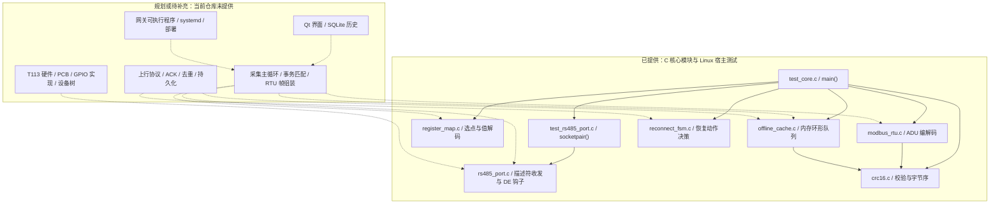

# 嵌入式 Linux 工业采集与边缘网关核心

[](https://github.com/xiaoli5201314-spec/embedded-linux-qt-edge-gateway/actions/workflows/ci.yml)

**C99 / Modbus RTU / RS485 / 寄存器解码 / 内存缓存 / 重连状态机**

本仓库提供面向工业仪表采集场景的六个 C 核心模块，以及 Linux 宿主单元测试：将协议编解码、串口收发、采集点调度和上行恢复策略拆开，便于分别阅读、验证和后续集成。

**交付范围：可复用的采集与网关核心 `core/`。** 当前以 GCC 测试程序复现模块行为；Qt 界面、板级支持和完整部署服务属于后续集成，详见文末工程边界。

快速入口：[验证记录](docs/VERIFICATION.md) · [构建与测试](docs/BUILD_AND_TEST.md) · [架构与 API 边界](docs/ARCHITECTURE.md) · [核心测试](core/test/test_core.c) · [端口测试](core/test/test_rs485_port.c)

**宿主验证记录（2026-10-02）**：在 WSL Ubuntu-22.04 / GCC 11.4.0 执行 `make -C core -B test`，得到 **170 checks、0 failed**。这是现有宿主测试的结果，不是板级或完整系统验收；详见 [验证范围与限制](docs/VERIFICATION.md)。

## 应用场景

以下是现有核心模块的可集成方向，不代表已完成现场部署：

- **仪表接入原型**：构造与解析 Modbus RTU 寄存器请求，适用于电能、温度等仪表数据接入的协议层验证。
- **异构寄存器解码**：用采集点描述表达寄存器位置、字序、比例和单位，验证不同设备的数据表达方式。
- **弱网恢复策略验证**：在宿主环境中检查内存积压队列、重试退避以及历史数据优先的动作决策。
- **嵌入式代码阅读与面试讨论**：围绕字节序、定长容量、传输测试注入和状态机集成讨论工程取舍。

## 源码亮点

| 关注点 | 已提供的实现 | 源码证据 |
|---|---|---|
| 协议与传输解耦 | `modbus_build_request()` / `modbus_parse_response()` 只处理字节缓冲区，不直接访问串口；支持 `0x03`、`0x06`、`0x10` | [modbus_rtu.c](core/src/modbus_rtu.c)、[modbus_rtu.h](core/include/modbus_rtu.h) |
| CRC 与字节序 | 按位、查表、增量三种接口；CRC 低字节在前，寄存器字段高字节在前 | [crc16.c](core/src/crc16.c)、[crc16.h](core/include/crc16.h) |
| 可注入的串口端口 | `rs485_open_fd()` 接入测试描述符；`rs485_write()` 与 `rs485_tx_complete()` 分离发送和 DE 释放；`rs485_de_set()` 是可覆写的弱符号 | [rs485_port.c](core/src/rs485_port.c)、[test_rs485_port.c](core/test/test_rs485_port.c) |
| 数据驱动的采集点 | 六种寄存器类型，`raw * scale + offset`；按 1 / 5 / 30 秒周期轮转选点，并跳过外部标记的隔离从站 | [register_map.c](core/src/register_map.c)、[register_map.h](core/include/register_map.h) |
| 有界内存缓存 | 512 个槽位，每条最多 48 字节；FIFO、槽位 CRC、`peek` / `commit` 分离；满时丢弃最旧记录并计数 | [offline_cache.c](core/src/offline_cache.c)、[offline_cache.h](core/include/offline_cache.h) |
| 可独立测试的恢复策略 | `reconnect_fsm_tick()` 返回重连、补传或发送新数据的动作；失败指数退避至上限，成功重置退避 | [reconnect_fsm.c](core/src/reconnect_fsm.c)、[reconnect_fsm.h](core/include/reconnect_fsm.h) |
| 无第三方测试框架 | 两个测试文件汇总断言和退出码；端口测试用 `socketpair()` 与覆写 DE 钩子观察软件行为 | [test_core.c](core/test/test_core.c)、[test_rs485_port.c](core/test/test_rs485_port.c) |

上述亮点描述的是源码行为，不等同于硬件时序测量、持续运行指标或线上可靠性证明。

## 系统架构

实线表示现有源码调用关系；虚线表示尚未提供的集成关系。模块之间不存在已完成的端到端采集与上传流水线。



具体接口契约与状态转换见 [ARCHITECTURE.md](docs/ARCHITECTURE.md)。

## 实现状态

“已实现”指存在对应源码，不代表完成板级验证或完整系统交付。宿主运行证据另见 [VERIFICATION.md](docs/VERIFICATION.md)。

| 功能或交付物 | 状态 | 当前边界 |
|---|---|---|
| Modbus CRC16 | 已实现 | 按位 / 查表 / 增量接口及帧校验；首次查表初始化未做并发保护 |
| Modbus RTU `0x03` / `0x06` / `0x10` | 已实现 | 请求构造、完整响应缓冲区解析及异常码；不负责接收帧组装、事务调度 |
| `0x04` 读输入寄存器 | 部分描述，未贯通 | 采集点表允许 `0x04`，但编解码器不支持该功能码 |
| Linux RS485 端口抽象 | 已实现，板级未验证 | 有 `termios` / `poll` / `tcdrain` 路径；默认 DE 钩子为空，无 GPIO 驱动或内核 RS485 配置 |
| 寄存器解码与轮询选点 | 已实现 | 最多 64 点；隔离数组仅对从站地址小于 32 的条目生效；没有失败计数和自动探测恢复 |
| 离线缓存 | 已实现，内存版本 | 满时覆盖最旧记录；没有文件、SQLite、`fsync` 或掉电恢复 |
| 重连与补传策略 | 已实现，需调用方集成 | 成功回调不自动切换到 `UPLINK_DRAINING`；测试显式设置状态；没有实际网络连接或 ACK |
| 宿主测试与 CI 配置 | 已提供 | CI 执行 GCC 构建与现有测试；通过状态与断言数量以实际运行日志为准 |
| Qt UI / SQLite / 完整采集应用 | 规划，未提供 | 无界面源码、数据库层、应用入口或多线程集成 |
| T113 硬件 / 原理图 / PCB / BOM | 规划，未提供 | 无设计文件，不声明硬件设计完成、板卡适配或实测结果 |
| U-Boot / 内核 / 设备树 / 固件镜像 | 规划，未提供 | `make cross` 仅尝试生成核心静态库，不构建 BSP 或系统镜像 |
| 上行通信 / 部署 / 运维 | 规划，未提供 | 无 TCP / HTTP / TLS 实现、服务文件、安装脚本或远程升级机制 |

## 目录导览

| 路径 | 阅读内容 |
|---|---|
| [core/Makefile](core/Makefile) | `all`、`test`、`cross`、`clean` 目标及实际编译参数 |
| [core/include/](core/include/) | 六个模块的公开结构体、枚举、容量和函数签名 |
| [core/src/](core/src/) | 六个 C 模块的对应实现 |
| [core/test/test_core.c](core/test/test_core.c) | CRC、协议、缓存、状态机与寄存器表的测试及聚合入口 |
| [core/test/test_rs485_port.c](core/test/test_rs485_port.c) | 非 TTY 描述符收发、DE 钩子顺序与参数测试 |
| [docs/ARCHITECTURE.md](docs/ARCHITECTURE.md) | 模块边界、数据契约、状态机与待集成责任 |
| [docs/BUILD_AND_TEST.md](docs/BUILD_AND_TEST.md) | Linux 构建、测试范围、日志解读与交叉编译限制 |
| [docs/VERIFICATION.md](docs/VERIFICATION.md) | 2026-10-02 宿主验证的命令、工具链、结果与未验证范围 |
| [.github/workflows/ci.yml](.github/workflows/ci.yml) | Ubuntu GCC 测试任务，支持 push、PR 和手动触发 |
| [.gitignore](.gitignore) | 构建产物、日志与敏感文件排除规则 |

`core/build/` 是生成目录，不属于源码交付；目录导览不列出尚不存在的 `qt-app/`、`firmware/` 或 `device-tree/`。

## 代码阅读路线

1. **先读行为示例**：[test_core.c](core/test/test_core.c) 的 `main()` 与 `test_modbus_rtu()`，建立输入、输出和错误码的认识。
2. **再读协议边界**：[modbus_rtu.h](core/include/modbus_rtu.h) 的 `modbus_request_t` / `modbus_response_t`，然后跟踪 `modbus_build_request()`、`modbus_parse_response()` 与 CRC 序列化。
3. **关注异构数据**：[register_map.c](core/src/register_map.c) 的 `reg_map_decode()` 和 `poll_scheduler_next()`，检查字序、缩放、到期判断与隔离范围。
4. **检查可靠性取舍**：[offline_cache.c](core/src/offline_cache.c) 的 `put` / `peek` / `commit`，以及 [reconnect_fsm.c](core/src/reconnect_fsm.c) 的动作返回与状态更新。
5. **最后看传输可测试性**：[rs485_port.c](core/src/rs485_port.c) 与 [端口测试](core/test/test_rs485_port.c)，区分 socketpair 软件验证和真实 UART / DE 电气时序。

## 构建与测试

以下命令在仓库根目录的 **Linux shell** 中执行，环境需要 GCC、GNU Make 和 Linux/POSIX 开发头文件。Windows 下请在 WSL/Linux 环境中运行；这些不是原生 PowerShell 构建命令。

```bash
# 从源码重新构建并运行现有宿主测试
make -C core clean
make -C core test CC=gcc
```

[Makefile](core/Makefile) 默认 `all: test`，因此 `make -C core CC=gcc` 也会构建并运行测试；`make test` 不只是构建。

- 默认参数：`-std=c99 -O2 -Wall -Wextra -Wpedantic -Wshadow -Wconversion`。
- 宿主产物：`core/build/test_core`，链接数学库 `-lm`。
- 输出包含 `checks`、`failed`、`result`；断言失败时退出码为 1。
- 已报告的宿主检查结果见 [验证记录](docs/VERIFICATION.md)；没有覆盖率、零警告或硬件性能数据，不从退出成功推断这些指标。
- [CI](.github/workflows/ci.yml) 在 Ubuntu 上执行同样的 clean / test 命令，不依赖 Qt 或硬件。

可选的现有交叉编译目标：

```bash
make -C core cross CROSS_CC=arm-linux-gnueabihf-gcc
```

其预期产物是 `core/build/libgateway_core.a`。该目标使用宿主 `ar`，重复编译源文件；工具链、归档兼容性和板级运行均未验证。完整前提和限制见 [BUILD_AND_TEST.md](docs/BUILD_AND_TEST.md)。

## 工程边界与后续工作

- **没有完整集成链路**：采集主循环、RTU 静默间隔与粘包/分包处理、请求响应匹配、超时策略、自动设备恢复都需要补充。串口 API 返回的是字节片段，不是完整 Modbus 事务。
- **不能宣称掉电不丢数据**：缓存是进程内存；满时有明确丢弃策略；CRC 仅检测槽位损坏。ACK 关联、持久化、重启恢复和服务端去重不在现有实现中。
- **状态机不是网络客户端**：`reconnect_fsm_on_connect_result()` 只更新计数和退避，成功后仍需外部设置补传状态；`drained_records` 统计补传动作，不是成功上传数。
- **不是严格非阻塞或实时调度**：`rs485_write()` 遇到持续不可写时会循环等待；TTY 路径的 `tcdrain()` 可能阻塞，不能据此声称端到端严格超时或多端口无阻塞。
- **参数与并发还需加固**：请求缓冲区按头文件契约使用 `MODBUS_MAX_ADU`；现有小缓冲区、极端数值与并发路径未全面验证。点表、缓存和状态对象需由调用方管理同步。
- **业务校验有限**：`reg_map_value_plausible()` 仅拒绝 NaN 和绝对值大于 `1e9` 的值，不是设备量程或告警规则；配置文件加载与热更新未实现。
- **交付证据有边界**：现有测试主要验证宿主逻辑，端口测试走非 TTY 分支；未提供板级测试、串口波形、吞吐/延迟、长期运行或部署证据。

后续优先方向是补齐事务层与输入边界验证，再接入持久化、ACK 和网络传输；Qt 界面与具体板卡适配属于独立的待交付层。现有仓库未附 `LICENSE` 文件，不据此作代码原创性或对外授权承诺。
