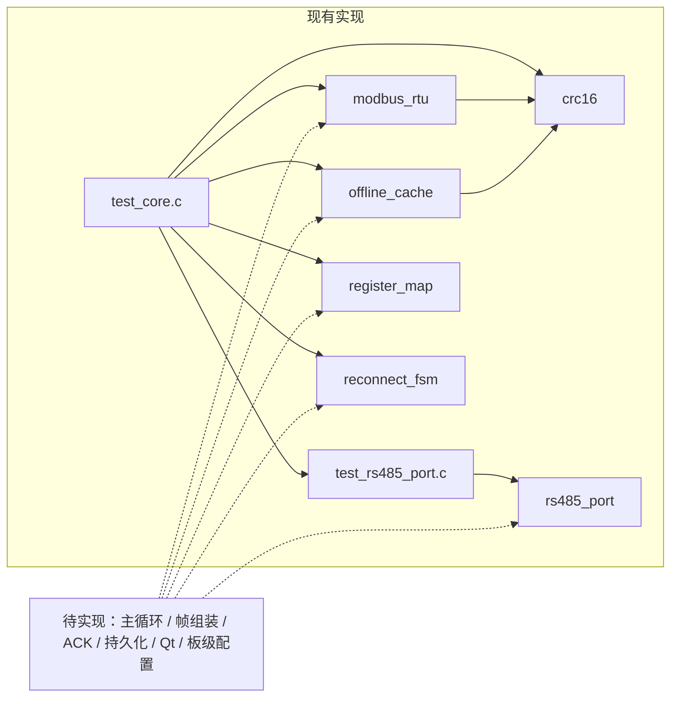
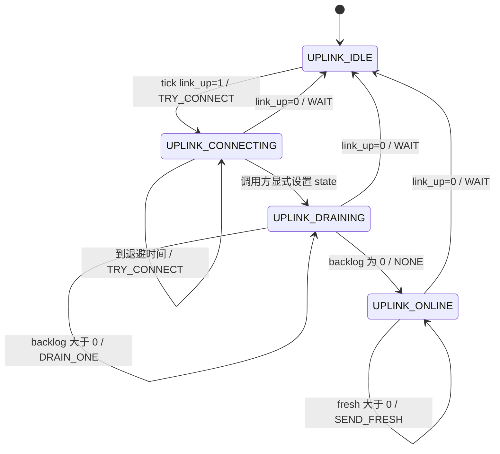

# 核心架构与接口边界

[返回 README](../README.md) · [构建与测试](BUILD_AND_TEST.md)

本文以 [core/include/](../core/include/) 的公开 API 和 [core/src/](../core/src/) 的实际实现为准。头文件中的“目标板”“掉电安全”等描述不能替代对应工程文件或测试证据；当前没有完整网关应用入口。

## 1. 模块分层与依赖

| 层次 | 模块 | 职责 | 直接依赖 |
|---|---|---|---|
| 校验基础 | [crc16.c](../core/src/crc16.c) | CRC 计算、线上字节序与帧尾校验 | C 标准类型 |
| 协议 | [modbus_rtu.c](../core/src/modbus_rtu.c) | 请求缓冲区构造、完整响应缓冲区解析 | `crc16.h` |
| 传输 | [rs485_port.c](../core/src/rs485_port.c) | TTY 配置、描述符读写、DE 钩子与发送完成检查 | Linux/POSIX API |
| 采集点 | [register_map.c](../core/src/register_map.c) | 点表、值解码、轮转选点 | C 标准库 |
| 缓存 | [offline_cache.c](../core/src/offline_cache.c) | 固定容量内存 FIFO 与槽位校验 | `crc16.h` |
| 恢复策略 | [reconnect_fsm.c](../core/src/reconnect_fsm.c) | 基于 tick 的重试、补传与实时发送动作 | C 标准类型 |

现有模块没有主动调用网络、数据库或 Qt。协议模块与端口模块之间也没有事务管理器；将它们串起来是应用层的待实现责任。

## 2. CRC16 与 Modbus 编解码

### CRC 接口

[crc16.h](../core/include/crc16.h) 定义 `CRC16_MODBUS_POLY = 0xA001`、`CRC16_MODBUS_INIT = 0xFFFF`。

- `crc16_modbus_bitwise(data, len)`：按位实现。
- `crc16_modbus(data, len)`：256 项查表实现，第一次使用时生成静态表。
- `crc16_modbus_update(crc, data, len)`：增量更新；调用方先将累积值初始化为 `CRC16_MODBUS_INIT`。
- `crc16_to_wire()` / `crc16_from_wire()`：CRC 低字节在前的序列化与还原。
- `crc16_check_frame(frame, len)`：比较帧末两字节与前面内容计算出的 CRC，返回 1 或 0。

CRC 查表首次初始化没有锁。并发使用前应由调用方在单线程初始化阶段完成首次计算，或在后续实现中补齐同步。

### 请求与响应

[modbus_rtu.h](../core/include/modbus_rtu.h) 的关键结构是 `modbus_request_t`、`modbus_response_t`：

| 功能码 | `modbus_build_request()` 使用的请求字段 | `modbus_parse_response()` 的响应结果 |
|---|---|---|
| `0x03` | `slave`、`start_addr`、`quantity`，数量 1..125 | `quantity` 和 `values[]`；响应不携带起始地址，调用方保留请求上下文 |
| `0x06` | `slave`、`start_addr`、`value`；`quantity` 必须为 0 | 回显 `start_addr`、`values[0]`，`quantity = 1` |
| `0x10` | `slave`、`start_addr`、`quantity`、`values`，数量 1..123 | 回显 `start_addr` 和 `quantity`，不返回所写寄存器数组 |

请求从站为 1..247，广播地址 0 被拒绝。寄存器地址、数量和值按高字节在前编码，CRC 按低字节在前编码。

- `modbus_build_request()` 成功返回帧长度，失败返回 -1。按照头文件要求分配 `uint8_t adu[MODBUS_MAX_ADU]`，`MODBUS_MAX_ADU = 256`。
- `modbus_parse_response(adu, len, expect_slave, expect_function, out)` 成功返回 0，异常响应或本地错误返回正数；`modbus_exception_str()` 提供名称。
- 正常解析应传入有效的 `modbus_response_t *out`，并在使用前初始化。`out == NULL` 时实现会提前返回，不执行后续功能码载荷结构检查，不能用作完整验证器。
- `MODBUS_EX_TIMEOUT` 是已定义的错误码，不是编解码器自行产生的串口超时；超时判断属于未提供的事务层。

当前解析器不关联原请求的起始地址、读取数量或写入值；它主要验证 CRC、预期从站、功能码及响应载荷格式。请求匹配和业务一致性校验需要调用方补充。

**输入边界注意事项**：`0x03` / `0x06` 的部分字段写入发生在最终 `out_cap` 检查前，因此不能把“传入较小容量”视为安全拒绝机制。本轮不修改源码，使用时遵守完整缓冲区契约；小缓冲区验证是后续加固项。

## 3. RS485 端口与软件测试注入

[rs485_port.h](../core/include/rs485_port.h) 提供不透明的 `rs485_port_t` 与配置结构 `rs485_config_t`。

| API | 实际行为与返回值 |
|---|---|
| `rs485_open(cfg)` | 打开设备并通过 `termios` 配置，成功返回端口指针，失败返回空指针；端口拥有该 fd |
| `rs485_open_fd(fd, cfg)` | 包装已有 fd，不配置 TTY；端口不拥有该 fd |
| `rs485_write(p, data, len)` | 先调用 DE 钩子拉高，再循环写入；返回写入字节数或 -1 |
| `rs485_tx_complete(p, timeout_ms)` | 非 TTY 走软件完成路径；TTY 尝试 `TIOCOUTQ` 与 `tcdrain()`，成功后等待 `de_guard_us` 并释放 DE；返回 1 或 0 |
| `rs485_read(p, buf, cap, timeout_ms)` | 单 fd `poll()` 后读取；返回字节数、无数据时 0、错误时 -1 |
| `rs485_reset_queues(p)` | 尝试 `tcflush()` 并释放已拉高的 DE；非 TTY 的 flush 不保证有效 |
| `rs485_close(p)` | 释放 DE、仅关闭自有 fd、释放端口对象 |

`rs485_de_set(int gpio, int level)` 定义于 [rs485_port.c](../core/src/rs485_port.c)，是默认空实现的弱符号，没有在头文件中声明。测试文件通过同签名的强符号覆写它，记录拉高/拉低事件。GPIO 实际驱动、内核自动方向控制配置和板级引脚映射均未提供。

需要区分两种执行路径：

- **宿主端口测试**：用 `socketpair(AF_UNIX, SOCK_STREAM, ...)` 和 `rs485_open_fd()`；没有真实 UART，`rs485_tx_complete()` 走 `!isatty()` 分支。
- **实际 TTY 路径**：需要设备权限和硬件；默认弱符号不能改变电平。现有测试没有验证波特率配置、UART 移位寄存器、保护时间或总线电气行为。

这不是完整异步端口引擎：`rs485_write()` 没有整体超时参数，持续 `EAGAIN` 时可能一直重试；TTY 的 `tcdrain()` 可能阻塞；`rs485_read()` 只返回当前片段，不保证一帧完整。帧边界、总线事务时序和跨端口调度需外部实现。

注入 fd 由调用方负责关闭。当前端口测试未显式关闭 `sv[0]`，不能据此声称已验证完整 fd 生命周期。

## 4. 寄存器点表与调度契约

[register_map.h](../core/include/register_map.h) 的 `reg_point_t` 描述点名、从站、功能码、寄存器位置、类型、缩放、单位与轮询级别。`reg_map_t` 存放最多 `REGMAP_MAX_ENTRIES = 64` 个点及调度账本。

- `reg_map_init(m)`：清空点表。
- `reg_map_add(m, pt)`：复制点描述；检查表容量、从站、功能码 `0x03` / `0x04` 和非零数量，成功为 0，失败为 -1。`name` / `unit` 的字符串内容不深拷贝，由调用方保证生命周期。
- `reg_map_decode(pt, words, word_count, out)`：从 `word_offset` 取一或两个寄存器，解码后应用 `scale` / `offset`；支持 `REG_U16`、`REG_S16`、`REG_U32_BE`、`REG_U32_WORD_SWAP`、`REG_FLOAT_ABCD`、`REG_FLOAT_CDAB`。
- `poll_scheduler_reset(m)`：清零各点上次轮询时间和轮转游标，不立即标记所有点到期。
- `poll_scheduler_next(...)`：基于调用方传入的 `now_ms` 选择一个到期点，返回 1；无候选返回 0。`POLL_FAST` / `POLL_NORMAL` / `POLL_SLOW` 周期分别为 1000 / 5000 / 30000 ms。
- `reg_map_value_plausible(pt, value)`：只检查点指针、NaN 与绝对值 `1e9` 上限，不使用设备量程。

调度边界：

1. 初始 `last_poll_ms` 为 0，时刻不足对应周期时该点不会被选中。选点时即记录时间，不等待请求成功。
2. `isolated` 数组由调用方维护；实现仅在 `slave < 32` 时读取 `isolated[slave]`。没有自动失败计数、降频或恢复探测。
3. 签名是 `const reg_map_t *m`，但实现转换指针后更新 `last_poll_ms` / `rotation`；必须传入实际可写对象，不可并发无锁访问。
4. 点表接受 `0x04`，但现有编解码器不支持它。当前可贯通的读请求应限定为 `0x03`。
5. `REGMAP_MAX_DEVICES` 是声明的常量，不是已实现的设备管理器或运行时设备上限检查；点表也没有配置文件解析与热加载。
6. 解码统一输出 `float`，大整数可能损失精度；浮点解码假设 32 位 IEEE754 表示。宽度检查与非法配置、极端参数还需要更完整的边界测试。

## 5. 内存缓存：FIFO 与确认责任

[offline_cache.h](../core/include/offline_cache.h) 定义 `cache_slot_t`、`offline_cache_t`。容量为 512 槽，每槽载荷上限 48 字节；记录包含序号、时间戳、设备号、载荷长度、载荷、CRC 和有效标记。

| API | 实际行为 |
|---|---|
| `offline_cache_init(c)` | 清空内存结构，`next_seq` 从 1 开始 |
| `offline_cache_put(c, payload, len, device_id, timestamp_s)` | 有效写入返回 1；空指针或超长载荷返回 0；满时丢弃最旧记录后仍写入并返回 1，增加 `dropped` |
| `offline_cache_peek(c, out)` | 复制最旧记录，不删除；空队列或头部 CRC / 标记异常返回 0 |
| `offline_cache_commit(c)` | 移除当前队首，返回 1；空队列返回 0；接口不接收 ACK 或 seq |
| `offline_cache_verify(c)` | 返回有效标记槽位中 CRC 不匹配的数量，不修复、不跳过损坏队首 |

`offline_cache_put()` 的头文件注释与满容量返回语义不一致；以上以实际 `.c` 实现为准。

预期的外部调用顺序是 `put` 保存采样，`peek` 获取队首，实际发送并验证 ACK 后再 `commit`。**网络发送、ACK 验证和序号去重未实现**。如果异步发送期间缓存已满而队首被覆盖，调用方还需确保 `commit()` 删除的确实是被确认的那条记录。

CRC 覆盖结构体起始到 `crc` 字段之前的内存。该布局不是跨平台稳定的文件或网络格式。没有持久化 I/O、事务落盘、掉电恢复或线程同步；序号是有限宽度计数器，初始化会重置，不能承诺永久唯一。损坏队首会阻止正常 `peek`，恢复策略需另行设计。

## 6. 重连状态机的真实状态转换

`reconnect_fsm_t` 保存状态、退避间隔和动作统计，不持有 socket、缓存或消息队列。

- `reconnect_fsm_init(f, min, max)`：初始化为 `UPLINK_IDLE`；`min == 0` 时采用 1000 ms；上限不足最小值时提升为最小值。
- `reconnect_fsm_tick(f, dt_ms, link_up, backlog, fresh)`：累计时间并返回 `FSM_ACT_*`，不实际连接、发送或移除缓存。
- `reconnect_fsm_on_connect_result(f, ok)`：成功增加 `connect_ok` 并重置退避；失败增加 `connect_fail` 并将退避翻倍至上限；两种结果都清零累计时间，但**不修改 `state`**。
- `reconnect_fsm_on_link_lost(f)`：回到 `UPLINK_IDLE`。
- `uplink_state_str()` / `reconnect_action_str()`：便于日志或测试输出。

因此不能把头文件中的 `CONNECTING -> DRAINING` 示意理解为成功回调已自动完成的状态转换。[test_reconnect_fsm()](../core/test/test_core.c) 在调用成功回调后显式执行 `f.state = UPLINK_DRAINING`。

`link_up` 是外部布尔输入，当前实现依赖它决定是否发出连接动作；实际网络“可用”和“已连接”的区分需要在接入传输层时明确。`drained_records` 在返回补传动作时累加，不能当成成功 ACK 数。退避无随机抖动，极大时间参数的溢出与重复连接动作也尚需加固。

## 7. 待实现的集成责任

- 采集循环将 `poll_scheduler_next()` 输出转换为 `modbus_request_t`，管理完整发送、接收、帧组装、超时与请求匹配。
- 业务层根据请求上下文选择 `reg_point_t`，调用 `reg_map_decode()`，定义采样载荷格式和实际设备量程。
- 上行层解释 `FSM_ACT_*`，实现连接结果到状态的明确转换，并维护 backlog、fresh、ACK 和持久化一致性。
- 板级层提供真实 DE 实现、串口/设备树配置与硬件测试；Qt、SQLite、部署文件均作为独立新增交付。

以上是责任划分，不是已完成代码。宿主测试范围与证据采集方法见 [BUILD_AND_TEST.md](BUILD_AND_TEST.md)。
